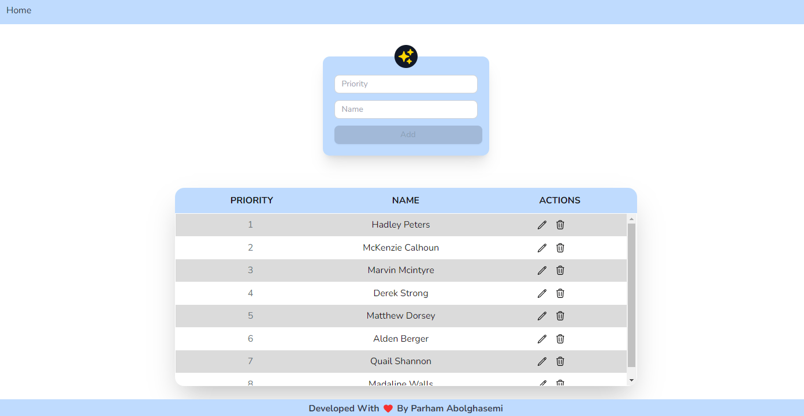
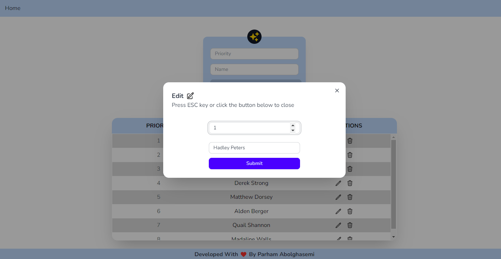

# React-Magic-Table

React-Magic-Table is a CRUD (Create, Read, Update, Delete) table component built using React.js and Vite. It provides a simple yet powerful way to manage and display tabular data in your React applications.




## Features

- **CRUD Operations**: Perform Create, Read, Update, and Delete operations on tabular data.
- **Sortable Table**: Easily reorder table content based on priority in ascending order.
- **Persistent Storage**: Data is saved locally using localStorage, ensuring persistence across sessions.
- **Form Validation**: Utilizes react-hook-form and Yup for robust form validation.
- **State Management**: Redux Toolkit is used for efficient state management.
- **Routing**: Built with react-router-dom for seamless navigation between different views.
- **User Notifications**: Utilizes react-hot-toast for displaying user-friendly notifications.
- **Styling**: Styled-components is used for creating styled components to enhance UI aesthetics.

## Dependencies

- [React.js](https://reactjs.org/)
- [Redux Toolkit](https://redux-toolkit.js.org/)
- [react-hook-form](https://react-hook-form.com/)
- [Yup](https://github.com/jquense/yup)
- [react-router-dom](https://reactrouter.com/web/guides/quick-start)
- [react-hot-toast](https://react-hot-toast.com/)
- [styled-components](https://styled-components.com/)


## Installation

To get started, simply clone the repository and install the dependencies:

```bash
git clone https://github.com/your-username/React-Magic-Table.git
cd React-Magic-Table
npm install
